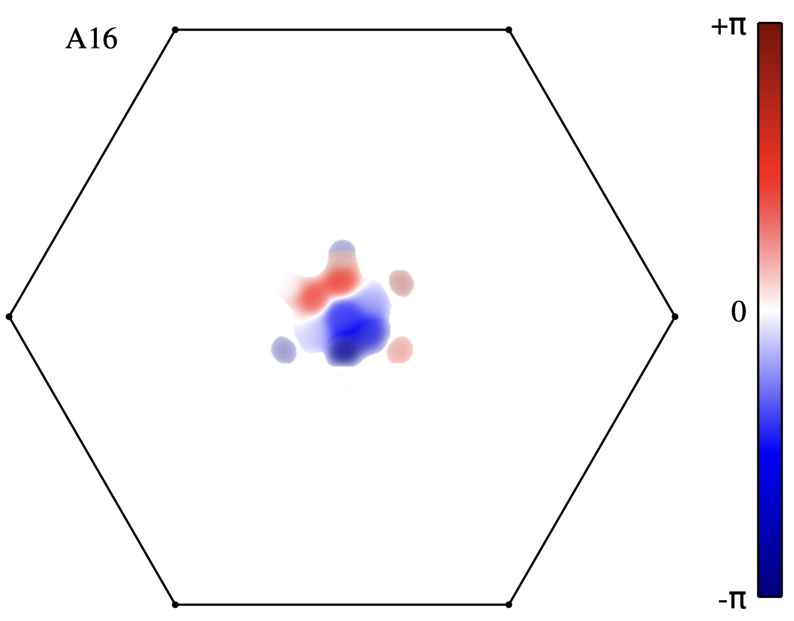

# AWFk
Plot wave function with phase information.

The program [Acvk.f90](src) reads envelope wave functions generated by Yambo and generates Gnuplot script to plot them.

Intensity of the color is proportional to the absolute value of the wave function, and the color (blue-red) is proportional to the phase.

